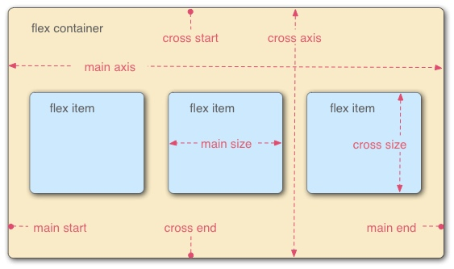

[TOC]

## 长度单位
### EM

em 单位转换为像素，取决于他们使用的字体大小（使用 em 单位单位元素的字体大小），此字体大小受从父元素继承过来的字体大小影响。
使用 em 要注意，每个元素会继承父元素的字体大小，除非显式声明一个具体单位。

当前元素 `font-size: 16px`，`padding: 1em` 结果为 16 * 1 = 16px。

### REM

取决于根元素的字体大小，即 html 元素的字体大小，计算时用根元素的字体大小乘以 rem 值，得到实际的像素大小。

### VW VH
 - vw 相对于视窗的宽度 100vw 即 window.innerWidth 的大小。
 - vh 相对于视窗的高度，100vh 为 window.innerHeight 的大小。

参考：[响应式布局的常用解决方案对比(媒体查询、百分比、rem和vw/vh）](https://github.com/forthealllight/blog/issues/13)

## 布局

### Flex
用于设置或检索弹性盒模型对象的子元素如何分配空间。

采用 flex 布局的元素，默认存在两根轴，水平的主轴和垂直的交叉轴。

row：主轴为水平方向，起点在左端。 `justify-content` 定义了项目在主轴上的对齐方式。

coloum: 主轴在垂直方向，起点在上沿。`align-item` 定义了项目在交叉轴的对齐方式。

参考：http://www.ruanyifeng.com/blog/2015/07/flex-grammar.html

### Grid
[Learn CSS Grid](https://learncssgrid.com/)
非常详细的介绍了 CSS Grid 的用法。

## 其他
### box-shadow
https://developer.mozilla.org/zh-CN/docs/Web/CSS/box-shadow

### border-image
https://developer.mozilla.org/zh-CN/docs/Web/CSS/border-image

### 媒体查询
https://developer.mozilla.org/zh-CN/docs/Web/Guide/CSS/Media_queries

## 参考
[CSS Protips](https://github.com/AllThingsSmitty/css-protips)
CSS 的一些使用技巧，值得参考

[学习CSS布局](http://zh.learnlayout.com/)

移动端适配

