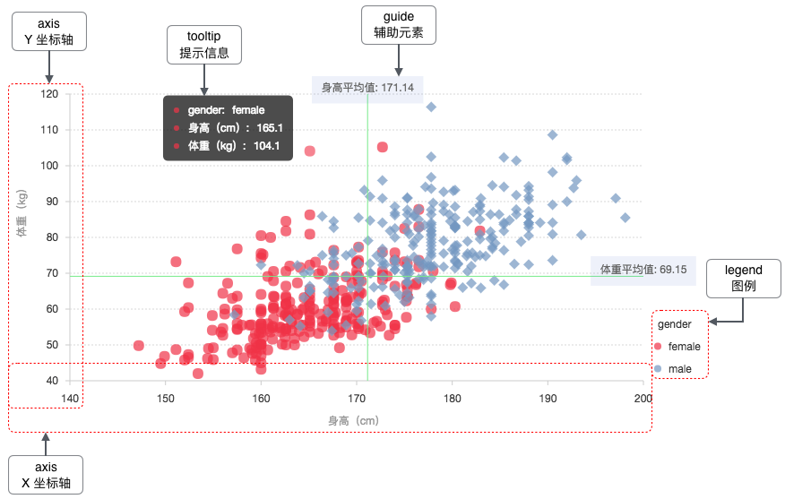

## Svg

SVG 是矢量图，在现在高分屏下，不会失真，常用在图标、矢量图片。可以通 Illustrator、PS 等工具导出。

了解一些关于 SVG 的概念。

[理解 SVG viewport,viewBox,preserveAspectRatio 缩放](https://www.zhangxinxu.com/wordpress/2014/08/svg-viewport-viewbox-preserveaspectratio/)

[svgr](https://github.com/smooth-code/svgr)
将 SVG 导出为 React 组建的工具

## Canvas
位图

## Chart
数据统计和可视化分析的时候，会用到一些折线图、柱状图、饼图、面积图等。
常用到图标库有 echart、g2、chartjs。

熟悉图表的构成，使用这些库只是配置项不同的问题。

对照图表，掌握各个配置项。

#### 坐标轴 AXES

每个图表通常包含两个坐标轴，在直角坐标系（笛卡尔坐标系）下，分别为 x 轴和 y 轴，在极坐标轴下，则分别由角度和半径 2 个维度构成。

每个坐标轴由坐标轴线（line）、刻度线（tickLine）、刻度文本（label）、标题（title）以及网格线（grid）组成。

#### 图例 LEGEND

图例作为图表的辅助元素，用于标定不同的数据类型以及数据的范围，用于辅助阅读图表，帮助用户在图表中进行数据的筛选过滤。

#### 提示信息 TOOLTIP

当鼠标悬停在某个点上时，会以提示框的形式显示当前点对应的数据的信息，比如该点的值，数据单位等。数据提示框内提示的信息还可以通过格式化函数动态指定。

## Map
配合 📈 使用，或者展示地理位置坐标信息。

[高德地图 JS API](https://lbs.amap.com/api/javascript-api/summary)

